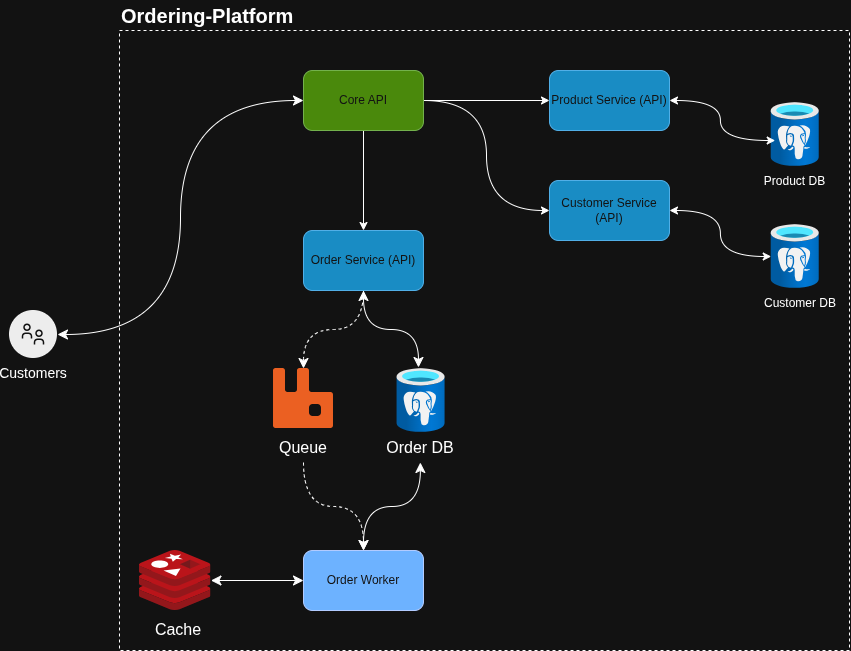
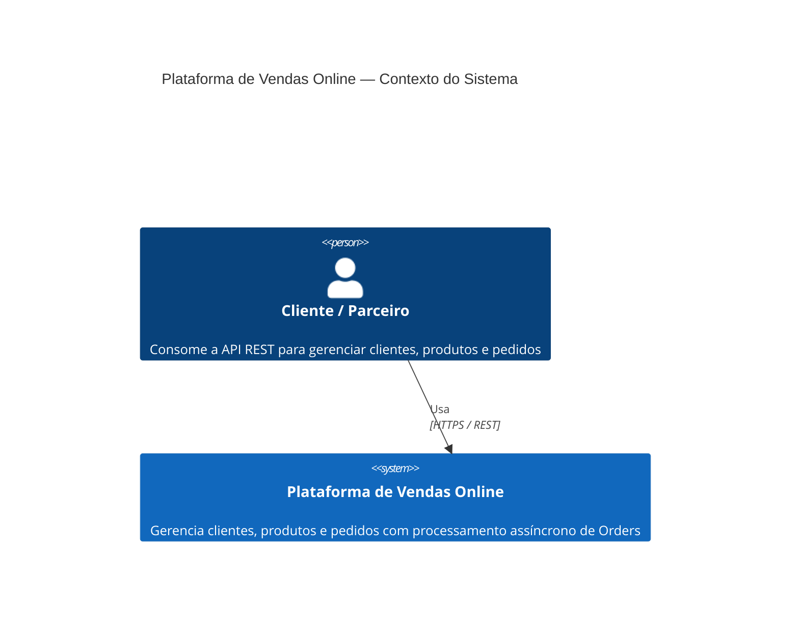
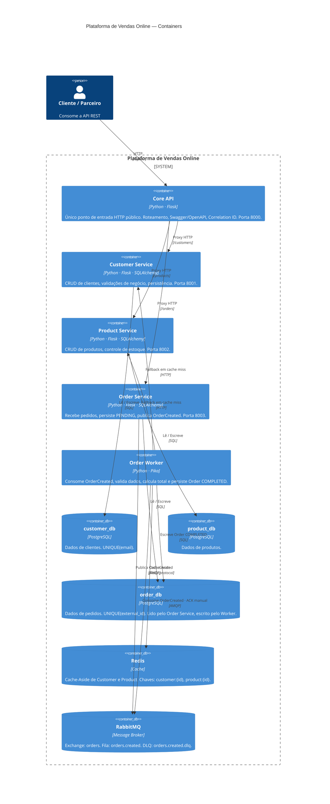
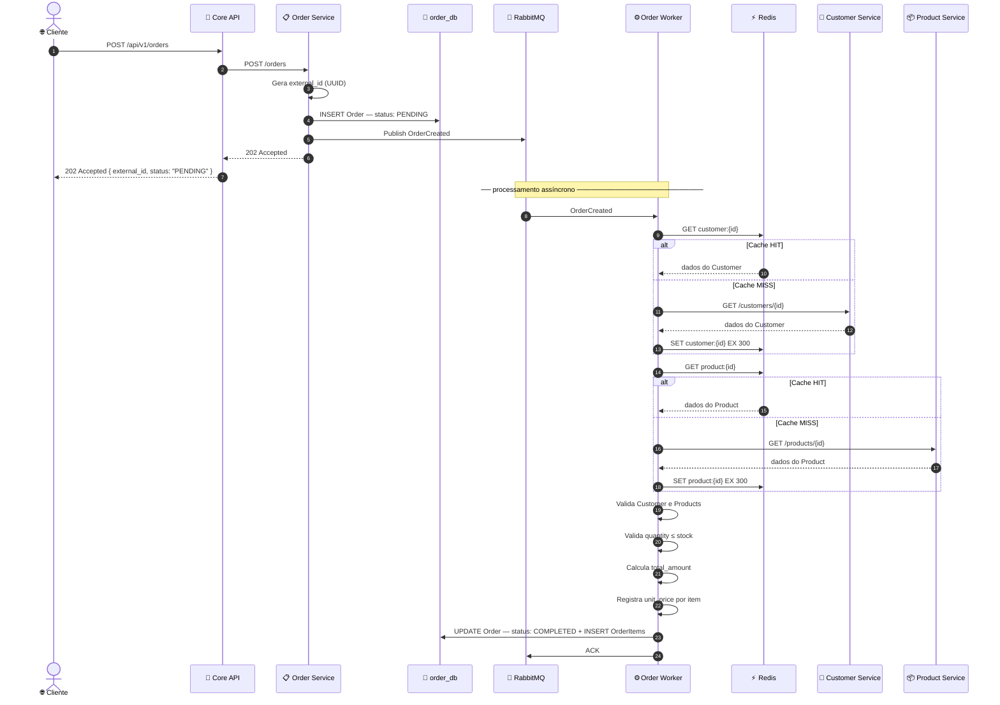
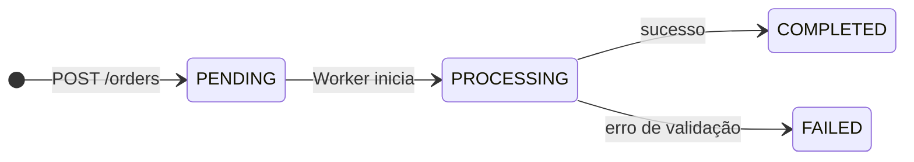
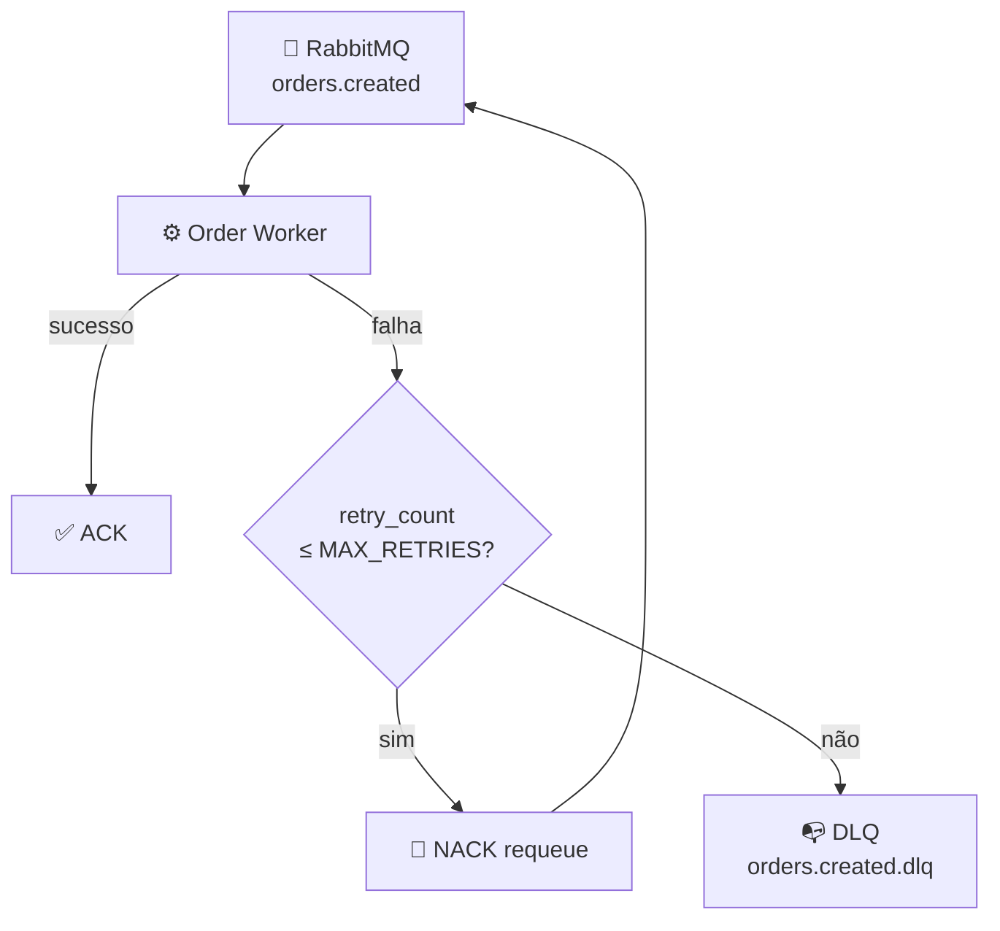

# 🛒 Plataforma de Vendas Online

Plataforma distribuída para gerenciamento de clientes, produtos e pedidos. Implementada como exercício de arquitetura de software com foco em microsserviços, processamento assíncrono e boas práticas de design.



---


## 🏗️ Arquitetura

### Nível 1 — Contexto



### Nível 2 — Containers



Cada serviço segue **Hexagonal Architecture** — o domínio não depende de Flask, SQLAlchemy, Redis, RabbitMQ ou qualquer infraestrutura. Dependências externas são acessadas por ports/interfaces.

```
  [ Adapters ] ──► [ Application ] ──► [ Domain ]
```

---

## 🔄 Fluxo de criação de pedido



> **Por que persistir antes do 202?** Para que `GET /orders/{external_id}` funcione imediatamente após a criação. O Worker transiciona o status do registro existente — não cria o pedido do zero.

### Estados da Order



### Retry e DLQ



---

## ⚙️ Stack

| | Tecnologia | Uso |
|---|---|---|
| 🐍 | Python 3.12 | Linguagem |
| 🌶️ | Flask | API REST |
| 🗄️ | SQLAlchemy | ORM / persistência |
| 🐘 | PostgreSQL | Fonte de verdade |
| ⚡ | Redis | Cache-Aside para Customer e Product |
| 🐰 | RabbitMQ + Pika | Fila de processamento assíncrono de Orders |
| 🐳 | Docker Compose | Orquestração do ambiente local |
| 🧪 | Pytest | Testes automatizados |
| 🔍 | Ruff | Linting e formatação |
| 🔎 | MyPy | Tipagem estática |

---

## 📐 Decisões relevantes

**🔀 Core API como único ponto de entrada.**
Centraliza roteamento, validação, Swagger e correlation ID. Os serviços internos permanecem desacoplados do contrato externo.

**🐘 Um PostgreSQL, três databases.**
`customer_db`, `product_db` e `order_db` no mesmo container — separação lógica de ownership sem três instâncias. Cada serviço acessa exclusivamente o seu banco. Cross-service DB access é proibido.

**⚙️ Order Worker compartilha código com Order Service.**
Mesmo contexto de domínio, dois processos. O código vive em `order-service/`; o Worker usa a mesma imagem com entrypoint `python -m order_service.worker`. Evita duplicar entidades e regras.

**⚡ Redis não é fonte de verdade.**
Cache-Aside para Customer e Product. Escrita vai ao PostgreSQL primeiro; cache é invalidado após sucesso. Falha ou flush do Redis não causa perda de dados.

**✅ ACK manual somente após commit.**
O Worker confirma a mensagem no RabbitMQ apenas após o `COMMIT` no banco. Redelivery é esperado em caso de falha — o processamento é idempotente para suportá-lo.

**🔁 Retry limitado e DLQ.**
Após `ORDER_MAX_RETRIES` tentativas (padrão: 3), a mensagem vai para a Dead Letter Queue via `x-dead-letter-exchange`. Sem loop infinito de requeue.

**🔒 Idempotência por constraint de banco.**
`UNIQUE(external_id)` no PostgreSQL impede duplicatas na persistência. Header `Idempotency-Key` + Redis NX está planejado como evolução futura.

---

## 📁 Estrutura do monorepo

```
ordering-platform/
├── 🔀 core-api/
├── 👤 customer-service/
├── 📦 product-service/
├── 📋 order-service/          ← contém também o código do Order Worker
│   └── src/order_service/
│       ├── domain/
│       ├── application/
│       ├── adapters/
│       │   ├── inbound/
│       │   │   ├── http/      ← Order Service HTTP
│       │   │   └── messaging/ ← Order Worker consumer
│       │   └── outbound/
│       ├── main.py            ← entrypoint HTTP
│       └── worker.py          ← entrypoint Worker
├── ⚙️  order-worker/          ← apenas Dockerfile
├── 🔧 shared/                 ← logging, correlation ID, errors, env utils
├── 📚 docs/
│   ├── conventions.md         ← contratos, nomes e fluxos táticos
│   └── decisions.md           ← ADRs
├── 🧪 tests/
├── 🐳 docker-compose.yml
└── .env.example
```

Cada serviço segue a estrutura interna:

```
src/<service>/
├── domain/       ← entidades, ports, exceções (zero dependência de infra)
├── application/  ← casos de uso
├── adapters/
│   ├── inbound/  ← HTTP controllers, RabbitMQ consumer
│   └── outbound/ ← repositórios, cache, clientes HTTP, publisher
├── config/
└── main.py
```

---

## 🚀 Como executar

**Pré-requisitos:** Docker e Docker Compose.

```bash
cp .env.example .env
docker compose up --build
```

| Serviço | URL |
|---|---|
| 📖 Swagger UI | http://localhost:8000/docs |
| 🔀 Core API | http://localhost:8000/api/v1 |

**Escalar o Order Worker horizontalmente:**

```bash
docker compose up --scale order-worker=3
```

---

## 📡 API pública

Base URL: `http://localhost:8000/api/v1`

### 👤 Customers
| Método | Endpoint | Descrição |
|---|---|---|
| `POST` | `/customers` | Criar cliente |
| `GET` | `/customers` | Listar clientes |
| `GET` | `/customers/{id}` | Buscar por ID |
| `GET` | `/customers/name/{name}` | Buscar por nome |
| `PUT` | `/customers/{id}` | Atualizar |
| `DELETE` | `/customers/{id}` | Remover |
| `GET` | `/customers/count` | Contar |

### 📦 Products
| Método | Endpoint | Descrição |
|---|---|---|
| `POST` | `/products` | Criar produto |
| `GET` | `/products` | Listar produtos |
| `GET` | `/products/{id}` | Buscar por ID |
| `GET` | `/products/name/{name}` | Buscar por nome |
| `PUT` | `/products/{id}` | Atualizar |
| `DELETE` | `/products/{id}` | Remover |
| `GET` | `/products/count` | Contar |

### 📋 Orders
| Método | Endpoint | Descrição |
|---|---|---|
| `POST` | `/orders` | Criar pedido → `202 Accepted` |
| `GET` | `/orders` | Listar pedidos |
| `GET` | `/orders/{external_id}` | Buscar por ID externo |
| `GET` | `/orders/count` | Contar |
| `PUT` | `/orders/{external_id}` | Atualizar (somente `PENDING`) |
| `DELETE` | `/orders/{external_id}` | Remover (somente `PENDING` ou `FAILED`) |

**Criação de Order:**
```json
// POST /api/v1/orders  →  202 Accepted
{ "external_id": "550e8400-...", "status": "PENDING" }
```

**Formato de erro:**
```json
{ "error": { "code": "RESOURCE_NOT_FOUND", "message": "...", "request_id": "uuid" } }
```

---

## 🧪 Testes

```bash
make test        # executa todos os testes
make lint        # Ruff check
make format      # Ruff format
make typecheck   # MyPy
```

---

## ⚠️ Limitações conhecidas

| Limitação | Status |
|---|---|
| Estoque não é decrementado ao completar uma Order | 🔜 Trabalho futuro |
| `Idempotency-Key` header + Redis NX não implementados | 🔜 Ver `docs/decisions.md` ADR-007 |
| Sem autenticação / autorização | 🔜 Fora do escopo atual |
| Sem paginação nas listagens | 🔜 Fora do escopo atual |
